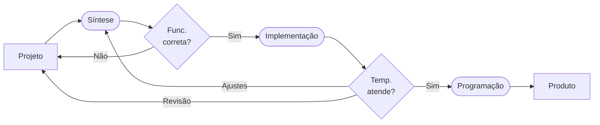

# Kits de FPGAs

!!! note 
    Neste tutorial estão informações sobre a tecnologia dos FPGAs, as ferramentas usadas para programá-los e alguns kits disponíveis. 

Um FPGA (Field-Programmable Gate Array) é um chip reprogramável que permite implementar circuitos digitais personalizados. Ao contrário de um processador (que executa instruções), o FPGA configura sua lógica interna para se tornar o circuito desejado.

## Características principais:

  * Composto por blocos lógicos programáveis e interconexões configuráveis.
  * Pode implementar desde circuitos simples como um contador, uma UART, até sistemas complexos, processadores, aceleradores de IA, etc.
  * É reprogramável, você pode alterar a lógica quantas vezes quiser, diferente de um ASIC que é fixo.

## Aplicações comuns:
  
  - Prototipagem de hardware;
  - Processamento de sinais digitais;
  - Aceleradores de IA, visão computacional e redes;
  - Sistemas embarcados (SoC com processador + lógica dedicada).

## Fluxo de desenvolvimento

Em linhas gerais, o desenvolvimento usando FPGAs segue o seguinte fluxo: 

O projeto é especificado geralmente em uma HDL, por exemplo, Verilog. Se a ***síntese*** for bem sucedida, é possível verificar a operação do circuito e saber se ele funciona corretamente, considerando apenas suas entradas e saídas, sem se preocupar ainda com a temporização. Esta etapa, chamada de RTL, gera um circuito lógico ainda independente da tecnologia alvo. A fase de ***implementação*** mapeia e roteia o circuito para um dispositivo específico. Após ela é possível saber se os requisitos temporais foram atingidos (e. g. frequência máxima). Em caso contrário, será necessário: **(i) ajustar** parâmetros de síntese, incluindo requisitos mais específicos; ou **(ii) revisar** o projeto para otimizar determinadas partes. Um vez que o circuito atende a especificação, a ***programação*** do dispositivo é feita diretamente no FPGA (que é volátil) ou em uma memória *flash* que fornecerá o *bitstream* ao FPGA sempre que a placa for ligada. 

!!! example "Minicurso"
    O Prof. Menotti ministrou um minicurso sobre o tema, [neste link](https://github.com/menotti/fpga) você encontra o material e as gravações. 

## Ferramentas de síntese

### Quartus

### Vivado

### Yosys

## Kits de FPGAs

A seguir estão alguns dos kits disponíveis em nosso grupo, mas fique à vontade para adicionar outros. 

### DE0-CV (Altera)

### DE10-standard (Altera)

### Tang Primer 20k (Sipeed/Gowin)

### Zybo Z7-20 (Xilinx)