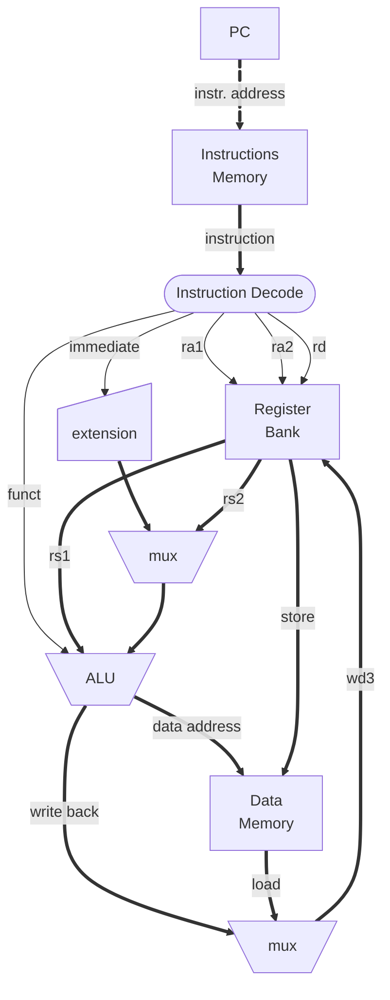

# RISC-V 

Os processadores são ***hardware* de propósito geral**, controlados por um programa armazenado na memória, manipulando dados também contidos na memória. Apesar de serem ineficientes – se comparados aos circuitos projetados para um propósito específico – eles são extremamente versáteis, pois podemos desenvolver programas para resolver os mais diversos problemas e usar sempre o mesmo *hardware* para executá-los.

Um processador *softcore* é aquele que, descrito em uma HDL, pode ser implementado diretamente em um FPGA. Existem muitos *cores* disponíveis atualmente. Neste tutorial vamos apresentar algumas ferramentas e primeiros passos de alguns projetos usados no nosso grupo de pesquisa, baseados no processador RISC-V. 

Os processadores RISC (*Reduced Instruction Set Computer*) possuem instruções simples, que são combinadas para executar tarefas mais complexas. O diagrama abaixo fornece uma idéia básica de como o RISC-V funciona, segundo algumas premissas: 

- Instruções e Dados podem estar na mesma memória ([von Neumann](https://pt.wikipedia.org/wiki/Arquitetura_de_von_Neumann)) ou em memórias separadas ([Harvard](https://pt.wikipedia.org/wiki/Arquitetura_Harvard)) como no diagrama a seguir.
- Operações lógicas e artiméticas possuem três operandos em registradores e são executadas na ALU (*Arithmetic Logic Unit*);
    * Instruções do **Tipo R** recebem dois registradores (`rs1` e `rs2`) como entrada e gravam o resultado em um terceiro (`rd`); 
    * Instruções do **Tipo I** recebem um registador apenas (`rs1`) e um imediato codificado na própria instrução como entrada. 
- Instruções **Load** / **Store** são usadas para trazer / levar dados da / para a memória;



Seu banco de registadores possui três portas independentes e pode ser implementado da seguinte maneira:

```verilog
module regfile(
    input clk, we3,            // write enable
    input [4:0] ra1, ra2, wa3, // rs1, rs2, rd (addr.)
    input [31:0] wd3,          // rd (data)
    output [31:0] rd1, rd2);   // rs1, rs2 (data)

  reg [31:0] rf [0:31];

  always@(posedge clk)
    if (we3) 
       rf[wa3] <= wd3;	

  assign rd1 = (ra1 != 0) ? rf[ra1] : 0;
  assign rd2 = (ra2 != 0) ? rf[ra2] : 0;
endmodule
```

Note que o registrador 0 (zero) é sempre zero, mas nesta implementação isso é tratado nas leituras ao invés da escrita. 

Se você quer se aprofundar na construção de um processador RISC-V, sugerimos este [excelente tutorial](https://github.com/BrunoLevy/learn-fpga/blob/master/FemtoRV/TUTORIALS/FROM_BLINKER_TO_RISCV/) do Prof. Bruno Levy.

## Geradores de SOCs

### Chipyard

### Litex

O framework LiteX fornece uma infraestrutura conveniente e eficiente para criar núcleos/SoCs FPGA e criar sistemas completos baseados em FPGA.

O LiteX fornece todos os componentes comuns necessários para criar facilmente um núcleo/SoC FPGA:

- Barramentos e fluxos (Wishbone, AXI, Avalon-ST) e suas interconexões.
- Núcleos simples: RAM, ROM, Timer, UART, JTAG, etc.
- Núcleos complexos através do ecossistema de núcleos: LiteDRAM, LitePCIe, LiteEth, LiteSATA, etc...
- Suporte a linguagens mistas com recursos de integração VHDL/Verilog/(n)Migen/Spinal-HDL/etc...
- Infraestrutura de depuração poderosa através de diversas pontes e Litescope.
- Simulação direta/rápida através do Verilator.
- Construir backends para cadeias de ferramentas de código aberto e de fornecedores.
- SoC Linux multinúcleo baseado em CPU VexRiscv-SMP, LiteDRAM e LiteSATA, construído e integrado com LiteX.

Para instalar o litex basta executar:

```sh
python3 -m venv litex-env
source litex-env/bin/activate
pip3 install ninja meson
```

```sh
mkdir litex && cd litex
wget https://raw.githubusercontent.com/enjoy-digital/litex/master/litex_setup.py
chmod +x litex_setup.py
./litex_setup.py --init --install --config standard
```

Para trabalhar com códigos RISC-V é preciso instalar a toolchain:
```sh
git clone https://github.com/riscv/riscv-gnu-toolchain && cd riscv-gnu-toolchain
sudo apt-get install autoconf automake autotools-dev curl python3 python3-pip python3-tomli libmpc-dev libmpfr-dev libgmp-dev gawk build-essential bison flex texinfo gperf libtool patchutils bc zlib1g-dev libexpat-dev ninja-build git cmake libglib2.0-dev libslirp-dev
./configure --prefix=/opt/riscv --enable-multilib --enable-newlib --enable-linux --enable-debug-info --with-arch=rv32gc --with-abi=ilp32d
make -j $(nproc) && sudo make install
```

No exemplo que se segue vamos usar o `VexRiscv` uma derivação do `NaxRiscv`, para isso temos que instalar o `verilator`, `sbt` e o `openjdk`:
```sh
git clone https://github.com/SpinalHDL/NaxRiscv.git --recursive
cd NaxRiscv
export NAXRISCV=${PWD}
make install-toolchain
```

Basta configurar a env `PATH` corretamente e estamos prontos para executar uma simulação:

Executando `litex_sim --help` diversas opções interessantes podem ser encontradas para configuração do SoC:

Para executar uma simulação vamos executar:
```sh
# 
litex_sim --integrated-main-ram-size=0x10000 --cpu-type=vexriscv --no-compile-gateware
litex_bare_metal_demo --build-path=build/sim/
litex_sim --integrated-main-ram-size=0x10000 --cpu-type=vexriscv --ram-init=demo.bin
```

Um console como esse será iniciado o SoC irá executar o código carregado:
```sh
        __   _ __      _  __
       / /  (_) /____ | |/_/
      / /__/ / __/ -_)>  <
     /____/_/\__/\__/_/|_|
   Build your hardware, easily!

 (c) Copyright 2012-2025 Enjoy-Digital
 (c) Copyright 2007-2015 M-Labs

 BIOS built on Sep 21 2025 00:35:41
 BIOS CRC passed (160356a0)

 LiteX git sha1: 51e4f2e65

--=============== SoC ==================--
CPU:            VexRiscv @ 1MHz
BUS:            wishbone 32-bit @ 4GiB
CSR:            32-bit data
ROM:            128.0KiB
SRAM:           8.0KiB
MAIN-RAM:       64.0KiB
```

Para execução na FPGA vamos usar como exemplo a `Tang Primer 20k`. O download da toolchain pode ser feito no link:
- https://cdn.gowinsemi.com.cn/Gowin_V1.9.11.03_Education_Linux.tar.gz

```sh
mkdir -p gowin && cd gowin
wget https://cdn.gowinsemi.com.cn/Gowin_V1.9.11.03_Education_Linux.tar.gz
tar -xvf Gowin_V1.9.11.03_Education_Linux.tar.gz
export LD_PRELOAD=/usr/lib64/libfreetype.so.6 # ou /lib/x86_64-linux-gnu/libfreetype.so
```

Vamos compilar usando o módulo `litex-boards`, a lista de placas suportadas pode ser encontrada em:
- https://github.com/litex-hub/litex-boards

```sh
# python3 -m litex_boards.targets.<board> --help
# python3 -m litex_boards.targets.<board> --help
python3 -m litex_boards.targets.sipeed_tang_primer_20k --build --load
```

Os códigos para serem executados no Core podem ser compilados na árvore:
- https://github.com/enjoy-digital/litex/tree/master/litex/soc/software/demo

E carregados no SoC de variadas formas, vamos usar um exemplo via serial:
- https://github.com/enjoy-digital/litex/wiki/Load-Application-Code-To-CPU

```sh
litex_term /dev/ttyUSBX --kernel=demo.bin
```

## Cores

### LightRiscv

### VexRiscv

### NaxRiscv