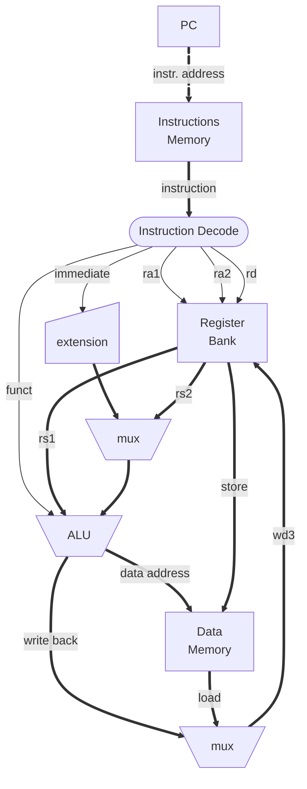

# RISC-V 

Os processadores são ***hardware* de propósito geral**, controlados por um programa armazenado na memória, manipulando dados também contidos na memória. Apesar de serem ineficientes – se comparados aos circuitos projetados para um propósito específico – eles são extremamente versáteis, pois podemos desenvolver programas para resolver os mais diversos problemas e usar sempre o mesmo *hardware* para executá-los.

Um processador *softcore* é aquele que, descrito em uma HDL, pode ser implementado diretamente em um FPGA. Existem muitos *cores* disponíveis atualmente. Neste tutorial vamos apresentar algumas ferramentas e primeiros passos de alguns projetos usados no nosso grupo de pesquisa, baseados no processador RISC-V. 

Os processadores RISC (*Reduced Instruction Set Computer*) possuem instruções simples, que são combinadas para executar tarefas mais complexas. O diagrama abaixo fornece uma idéia básica de como o RISC-V funciona, segundo algumas premissas: 

- Instruções e Dados podem estar na mesma memória ([von Neumann](https://pt.wikipedia.org/wiki/Arquitetura_de_von_Neumann)) ou em memórias separadas ([Harvard](https://pt.wikipedia.org/wiki/Arquitetura_Harvard)) como no diagrama a seguir.
- Operações lógicas e artiméticas possuem três operandos em registradores e são executadas na ALU (*Arithmetic Logic Unit*);
    * Instruções do **Tipo R** recebem dois registradores (`rs1` e `rs2`) como entrada e gravam o resultado em um terceiro (`rd`); 
    * Instruções do **Tipo I** recebem um registador apenas (`rs1`) e um imediato codificado na própria instrução como entrada. 
- Instruções **Load** / **Store** são usadas para trazer / levar dados da / para a memória;


```mermaid
flowchart TD
    PC[PC] e1@==> |instr. address| IM; 
    e1@{ animate: true }
    IM[Instructions 
    Memory] ==> |instruction| ID([Instruction Decode]);
    ID --> |ra1| R;
    ID --> |ra2| R;
    ID --> |rd| R;
    R[Register
      Bank]
    ID --> |immediate| E;
    E@{ shape: manual-input, label: "extension"};
    E ==> MA;
    ID --> |funct| A
    R ==> |rs1| A;
    R ==> |rs2| MA;
    MA[\mux/] ==> A[\ALU/];
    A ==> |data address| DM[Data 
                       Memory];
    A ==> |write back| MR;
    MR[\mux/] ==> |wd3|R;
    R ==> |store| DM;
    DM ==> |load| MR;
```

Seu banco de registadores possui três portas independentes e pode ser implementado da seguinte maneira:

```verilog
module regfile(
    input clk, we3,            // write enable
    input [4:0] ra1, ra2, wa3, // rs1, rs2, rd (addr.)
    input [31:0] wd3,          // rd (data)
    output [31:0] rd1, rd2);   // rs1, rs2 (data)

  reg [31:0] rf [0:31];

  always@(posedge clk)
    if (we3) 
       rf[wa3] <= wd3;	

  assign rd1 = (ra1 != 0) ? rf[ra1] : 0;
  assign rd2 = (ra2 != 0) ? rf[ra2] : 0;
endmodule
```

Note que o registrador 0 (zero) é sempre zero, mas nesta implementação isso é tratado nas leituras ao invés da escrita. 

Se você quer se aprofundar na construção de um processador RISC-V, sugerimos este [excelente tutorial](https://github.com/BrunoLevy/learn-fpga/blob/master/FemtoRV/TUTORIALS/FROM_BLINKER_TO_RISCV/) do Prof. Bruno Levy.

## Geradores de SOCs

### Chipyard

Chipyard é um *framework* para projetar e avaliar *hardware* de sistemas completos. É composto por uma coleção de ferramentas e bibliotecas projetadas para fornecer 
integração entre ferramentas de código aberto e comerciais para o desenvolvimento de *systems-on-chip*. O projeto tem uma [página dedicada](https://chipyard.readthedocs.io/en/latest/) à documentação, com guias e informações mais detalhadas do [repositório](https://github.com/ucb-bar/chipyard).

O *framework* junta diversos projetos abertos chamados geradores RTL, responsáveis por gerar descrições RTL (*Register-Transfer Level*), escritas na linguagem `Verilog`. A geração de `Verilog`, como é comumente chamada, começa com código em `Scala` e, após uma cadeia de processos, acaba com o arquivo `Verilog`.
Esta cadeia de processos utiliza algumas ferramentas, principalmente o `Chisel`, uma biblioteca para descrição de *hardware* incorporada em `Scala`; e o `FIRRTL`, uma biblioteca de representação intermediária para descrição RTL de projetos digitais.
De forma resumida, o gerador RTL é escrito em `Scala` com o uso da biblioteca `Chisel`, o compilador `Chisel` transforma o gerador em uma saída `FIRRTL`, que por sua vez permite a manipulação de circuitos digitais para a geração do `Verilog`.

Além dos tópicos estritamente relacionados à geração de `Verilog`, o *framework* também possui ferramentas para simulação, compilação e teste de códigos. 
Dentre estas ferramentas, existe o repositório *riscv-tools*, uma coleção de cadeias de ferramentas de software usadas para desenvolver e executar *software* no ISA RISC-V.
Na parte da simulação de `Verilog`, a principal ferramenta aberta utilizada é o `Verilator`. O *framework* fornece *wrappers* que constroem simuladores baseados no `Verilator` a partir de RTL gerado, permitindo a execução de programas RISC-V no simulador.
Assim, é possível montar, compilar e testar programas para o ISA do RISC-V, tanto de forma a verificar o funcionamento do programa isolado (e.g. com simuladores de ISA, como `spike`), quanto de forma a simular a execução em um processador real, descrito em `Verilog`.

#### *Setup* Inicial do Repositório

A documentação do *framework* apresenta uma [descrição](https://chipyard.readthedocs.io/en/latest/Chipyard-Basics/Initial-Repo-Setup.html) detalhada do processo de *setup*. 
De forma resumida, o *setup* é feito através de três passos:

1. Pré-requisitos:  [`conda`](https://github.com/conda-forge/miniforge/#download) e `git`; 

    OBS.: se durante a instalação do `conda` você escolher não ativá-lo sempre ao abrir o terminal, garanta que ele esteja ativo nos próximos passos.
    ```bash
    conda activate base
    ```

2. Configurando o repositório: após fazer o *clone* e *checkout* na última *release* do repositório é preciso executar o script que vai de fato realizar o *setup*. 
    ```bash
    git clone https://github.com/ucb-bar/chipyard.git
    cd chipyard
    # checkout latest official chipyard release
    # note: this may not be the latest release if the documentation version != "stable"
    git checkout main    
    ```
    O *script* tem 11 etapas, de forma que é possível pular alguma (caso não utilize a *feature* construída naquela etapa).
    ```bash
    ./build-setup.sh riscv-tools -s 6 -s 7 -s 8 -s 9
    ```
    Sugiro pular estas etapas caso não vá utilizar `FireSim`.

3. *Sourcing* do `env.sh`: após o *setup* o arquivo `env.sh` ficará disponível no diretório base. 
    Ele tem como função ativar o ambiente `conda` e configurar as variáveis de ambiente para as etapas futuras.
    É necessário fazer o `source` toda vez antes de fazer algum `make` dentro do repositório.
    ```bash
    source ./env.sh
    ```

Com todos os passos concluídos, é possível explorar de forma efetiva o repositório.

#### Simulação de Códigos RISC-V

A simulação da ISA é feita principalmente pela ferramenta `spike`, dentro do ambiente `conda` temos:

```bash
$ spike -h
Spike RISC-V ISA Simulator 1.1.1-dev

usage: spike [host options] <target program> [target options]
Host Options:
...
```

tente executar e ler todas as `Host Options`, pois existem diversas configurações úteis que podem servir como solução para um futuro problema.

Para simular é preciso antes ter algum código, tomemos como exemplo um "`hello, world!`" simples em `C`:
```c
#include <stdio.h>

int main(){
    printf("Hello, World!\n");
    return 0;
}
```

Utilizando o `gcc` é possível compilar e executá-lo, assim:

```bash
$ gcc hello.c -o hello && file hello && ./hello 
hello: ELF 64-bit LSB pie executable, x86-64, version 1 (SYSV), dynamically linked, interpreter /lib64/ld-linux-x86-64.so.2, for GNU/Linux 3.2.0, not stripped
Hello, World!
```

Porém, vemos que a ISA utilizada é diferente daquela que desejamos, RISC-V. Assim, de forma a compilar um código para RISC-V é necessário utilizar a `toolchain` específica:

```bash
$ riscv64-unknown-elf-gcc hello.c -o hello && file hello && ./hello 
hello: ELF 64-bit LSB executable, UCB RISC-V, version 1 (SYSV), statically linked, not stripped
bash: ./hello: cannot execute binary file: Exec format error
```

Agora o arquivo foi compilado na arquitetura `UCB RISC-V` como desejado, porém não foi possível executá-lo localmente, já que esta máquina possui outra arquitetura. Finalmente é hora de utilizar o `spike`, de forma a simular a execução do código `RISC-V`.

```bash
$ spike hello
Access exception occurred while loading payload hello:
Memory address 0x125e0 is invalid
```

Existe ainda um problema nesta simulação, só é possível executar um binário direto com o `spike` caso ele seja `baremetal`, caso contrário, é necessário utilizar outra ferramenta, o `proxy kernel` ou `pk`.

```bash
$ spike pk hello
Hello, World!
```

Agora, é possível criar códigos em C, compilá-los para a arquitetura alvo desejada e simular a execução dos binários.

##### Compilando Binários *Bare Metal*

Existe um diretório na raiz do repositório, chamado `tests`, que permite a criação de binários *baremetal* a partir de códigos em `C`. O processo é feito por `cmake`, e o arquivo `CMakeLists.txt` traz a configuração do mesmo, além de uma documentação simples de uso:

```bash
# file:  CMakeLists.txt
#
# usage: 
#   Edit "VARIABLES"-section to suit project requirements.
#   Build instructions:
#     cmake -S ./ -B ./build/ -D CMAKE_BUILD_TYPE=Debug
#     cmake --build ./build/ --target all
#   Cleaning:
#     cmake --build ./build/ --target clean
```

Com o intuito de demonstrar como adicionar algum código nesta lista, vou utilizar o mesmo codigo em `C` de anteriormente, porém com o nome `my_hello.c`. Primeiro, é preciso adicionar o executável no `CMakeLists.txt`, através do comando `add_executable()`:

```bash
add_executable(my_hello my_hello.c)
```
Agora, com o arquivo dentro do diretório e configurado dentro do `CMakeLists`, basta seguir os passos de uso do `cmake`:

```bash
$ cmake -S ./ -B ./build/ -D CMAKE_BUILD_TYPE=Debug && cmake --build ./build/ --target all
```

Com todos os binários prontos, é possível utilizar o `spike` para simular a execução do binário *baremetal*:

```bash
$ spike build/my_hello.riscv 
Hello, World!
```

-----

### Litex

O framework LiteX fornece uma infraestrutura integrada para criar SoCs e integrar periféricos. Sendo capaz de criar sistemas completos baseados em FPGA.

```txt
                                      +---------------+
                                      |FPGA toolchains|
                                      +----^-----+----+
                                           |     |
                                        +--+-----v--+
                       +-------+        |           |
                       | Migen +-------->           |
                       +-------+        |   LiteX   +
              +----------------------+  |           |
              |LiteX Cores Ecosystem +-->           |
              +----------------------+  +-^-------^-+
               (Eth, SATA, DRAM, USB,     |       |
                PCIe, Video, etc...)      +       +
                                         board   target
                                         file    file
```

O LiteX fornece todos os componentes comuns necessários para criar facilmente um núcleo/SoC FPGA:

- Barramentos (Wishbone, AXI, Avalon-ST).
- Núcleos simples: RAM, ROM, Timer, UART, JTAG, etc.
- Núcleos complexos através do ecossistema de núcleos: LiteDRAM, LitePCIe, LiteEth, LiteSATA, etc...
- Suporte a linguagens mistas com recursos de integração VHDL/Verilog/Migen/Spinal-HDL/etc...
- Infraestrutura de depuração através de diversas Bridges ou Litescope.
- Simulação simplificada através do Verilator.
- SoC Linux multinúcleo baseado em CPU VexRiscv-SMP, LiteDRAM e LiteSATA (https://github.com/litex-hub/linux-on-litex-vexriscv).

Para trabalhar com códigos RISC-V é preciso compilar a toolchain gnu:
```sh
git clone https://github.com/riscv/riscv-gnu-toolchain && cd riscv-gnu-toolchain
sudo apt-get install autoconf automake autotools-dev curl python3 python3-pip python3-tomli libmpc-dev libmpfr-dev libgmp-dev gawk build-essential bison flex texinfo gperf libtool patchutils bc zlib1g-dev libexpat-dev ninja-build git cmake libglib2.0-dev libslirp-dev
./configure --prefix=/opt/riscv --enable-multilib --enable-newlib --enable-linux --enable-debug-info --with-arch=rv32gc --with-abi=ilp32d
make -j $(nproc) && sudo make install
```

Para instalar o litex basta criar um python virtual environment e depois executar o script de instalação:
```sh
python3 -m venv litex-env
source litex-env/bin/activate
pip3 install ninja meson
```

```sh
mkdir litex && cd litex
wget https://raw.githubusercontent.com/enjoy-digital/litex/master/litex_setup.py
chmod +x litex_setup.py
./litex_setup.py --init --install --config standard
```
Executando `litex_sim --help` diversas opções interessantes podem ser encontradas para configuração do SoC:

Para executar uma simulação simples com vexriscv vamos instalar as dependências, o `verilator`, `sbt` e o `openjdk`.
```sh
sudo apt install verilator sbt openjdk
```

Gerar o SoC:
```sh
litex_sim --integrated-main-ram-size=0x10000 --cpu-type=vexriscv --no-compile-gateware
```

Para executar um código simples simulado como exemplo vamos executar o `donut`:
```sh
litex_sim --integrated-sram-size=0x2000 --integrated-main-ram-size=0x10000 --cpu-type=vexriscv --cpu-variant=full --no-compile-gateware
litex_bare_metal_demo --build-path=build/sim/
litex_sim --integrated-sram-size=0x2000 --integrated-main-ram-size=0x10000 --cpu-type=vexriscv --cpu-variant=full --ram-init=demo.bin
```

Um console como esse será iniciado o SoC irá executar o código carregado:
```sh
        __   _ __      _  __
       / /  (_) /____ | |/_/
      / /__/ / __/ -_)>  <
     /____/_/\__/\__/_/|_|
   Build your hardware, easily!

 (c) Copyright 2012-2025 Enjoy-Digital
 (c) Copyright 2007-2015 M-Labs

 BIOS built on Sep 21 2025 00:35:41
 BIOS CRC passed (160356a0)

 LiteX git sha1: 51e4f2e65

--=============== SoC ==================--
CPU:            VexRiscv @ 1MHz
BUS:            wishbone 32-bit @ 4GiB
CSR:            32-bit data
ROM:            128.0KiB
SRAM:           8.0KiB
MAIN-RAM:       64.0KiB
```

Para execução na FPGA vamos usar como exemplo a `Tang Primer 20k`. O download da toolchain pode ser feito no link:
- https://cdn.gowinsemi.com.cn/Gowin_V1.9.11.03_Education_Linux.tar.gz

```sh
mkdir -p gowin && cd gowin
wget https://cdn.gowinsemi.com.cn/Gowin_V1.9.11.03_Education_Linux.tar.gz
tar -xvf Gowin_V1.9.11.03_Education_Linux.tar.gz
export LD_PRELOAD=/usr/lib64/libfreetype.so.6 # ou /lib/x86_64-linux-gnu/libfreetype.so
```

Vamos compilar usando o módulo `litex-boards`, a lista de placas suportadas pode ser encontrada em:
- https://github.com/litex-hub/litex-boards

```sh
# python3 -m litex_boards.targets.<board> --help
python3 -m litex_boards.targets.sipeed_tang_primer_20k --build
litex_bare_metal_demo --build-path=build/sipeed_tang_primer_20k/
python3 -m litex_boards.targets.sipeed_tang_primer_20k --load
```

Os códigos para serem executados no Core podem ser compilados na árvore:
- https://github.com/enjoy-digital/litex/tree/master/litex/soc/software/demo

E carregados no SoC de variadas formas, vamos usar um exemplo via serial:
- https://github.com/enjoy-digital/litex/wiki/Load-Application-Code-To-CPU

```sh
litex_term /dev/ttyUSBX --kernel=demo.bin
```

## Cores

### LightRiscv

### VexRiscv
O VexRiscv é uma implementação RISC-V escrita em SpinalHDL, derivação do NaxRiscv. Dentre os recursos suportados estão:

- Conjunto de instruções RV32I[M][A][F[D]][C].
- Pipeline de 2 a 5+ estágios ([Buscar*X], Decodificar, Executar, [Memória], [Gravar]).
- Otimizado para FPGA, não utiliza nenhum bloco IP/primitivo específico do prorpietário.
- Otimizado para AXI4, Avalon e wishbone.
- Extensões MUL/DIV opcionais / FPU F32/F64 opcional / MMU opcional.
- Extensão de depuração opcional que permite a depuração do Eclipse por meio de uma conexão GDB >> openOCD >> JTAG
- Interrupções e tratamento de exceções opcionais com os modos de execução [Supervisor] e [Usuário], conforme definido no RISC-V Privileged ISA Especificação v1.10.
- Compatível com Linux (SoC: https://github.com/enjoy-digital/linux-on-litex-vexriscv)
- Ports para Zephyr e FreeRTOS.

Para gerar um core é preciso instalar as dependências, `verilator` (3.9+), `sbt` e o `openjdk` (8):
```sh
# JAVA JDK 8
sudo add-apt-repository -y ppa:openjdk-r/ppa
sudo apt-get update
sudo apt-get install openjdk-8-jdk -y
sudo update-alternatives --config java
sudo update-alternatives --config javac

# Install SBT - https://www.scala-sbt.org/
echo "deb https://repo.scala-sbt.org/scalasbt/debian all main" | sudo tee /etc/apt/sources.list.d/sbt.list
echo "deb https://repo.scala-sbt.org/scalasbt/debian /" | sudo tee /etc/apt/sources.list.d/sbt_old.list
curl -sL "https://keyserver.ubuntu.com/pks/lookup?op=get&search=0x2EE0EA64E40A89B84B2DF73499E82A75642AC823" | sudo apt-key add
sudo apt-get update
sudo apt-get install sbt

# Verilator (for sim only, really needs 3.9+, in general apt-get will give you 3.8)
sudo apt-get install git make autoconf g++ flex bison
git clone http://git.veripool.org/git/verilator   # Only first time
unsetenv VERILATOR_ROOT  # For csh; ignore error if on bash
unset VERILATOR_ROOT  # For bash
cd verilator
git pull        # Make sure we're up-to-date
git checkout v4.216
autoconf        # Create ./configure script
./configure
make
sudo make install
```

Basta agora gerar o SoC:
```sh
sbt "runMain vexriscv.demo.GenFull"
```

Vários cores pré-configurados como (Murax, Briey, Linux, GenFull, GenSmallest) podem ser encontrados em:
https://github.com/SpinalHDL/VexRiscv/tree/master/src/main/scala/vexriscv/demo

Existem vários plugins que podem ser adicionados e criados, alguns exemplos dos que já existem são:

- HazardSimplePlugin
- BranchPlugin
- MulPlugin
- DivPlugin
- CsrPlugin
- DebugPlugin
- EmbeddedRiscvJtag
- FpuPlugin


### NaxRiscv

O NaxRiscv é uma implementação RISC-V escrita em SpinalHDL. Dentre os recursos suportados estão:

- Execução fora de ordem com renomeação de registradores.
- Superscalar (ex: 2 decodificadores, 3 unidades de execução, 2 desativadas).
- (RV32/RV64)IMAFDCSU (Linux/Buildroot funciona em hardware).
- HDL portátil, mas FPGA com RAM distribuída.
- Elaboração de hardware descentralizada (nível superior vazio parametrizado com plugins).
- Frontend implementado em torno de uma estrutura de pipeline para facilitar a personalização.
- MMU com hardware reabastecido (SV32, SV39).
- Visualização do pipeline por meio de simulação do Verilator e Konata.
- Suporte a JTAG / OpenOCD / GDB implementando o RISCV External Debug Support v. 0.13.2

No exemplo que se segue vamos usar o `VexRiscv` uma derivação do `NaxRiscv`, para isso temos que instalar o `verilator`, `sbt` e o `openjdk`:
```sh
git clone https://github.com/SpinalHDL/NaxRiscv.git --recursive
cd NaxRiscv
export NAXRISCV=${PWD}
make install-toolchain
```
Basta configurar a env `PATH` corretamente e estamos prontos para executar uma simulação.

Para gerar o SoC:
```sh
export NAXRISCV=${PWD}
(cd ext/NaxSoftware && ./init.sh)
# Generate NaxRiscv
cd $NAXRISCV
sbt "runMain naxriscv.Gen"
```

Para executar a simulação é preciso compilar as dependências e depois o simulador:
```sh
# Install SDL2, allowing the simulation to display a framebuffer
sudo apt-get install libsdl2-2.0-0 libsdl2-dev

# Compile the simulator
cd $NAXRISCV/src/test/cpp/naxriscv
make compile
./obj_dir/VNaxRiscv
```

Para executar linux em uma simulação:
```sh
cd $NAXRISCV/src/test/cpp/naxriscv
export LINUX_IMAGES=$NAXRISCV/ext/NaxSoftware/buildroot/images/rv32ima
./obj_dir/VNaxRiscv \
    --load-bin $LINUX_IMAGES/fw_jump.bin,0x80000000 \
    --load-bin $LINUX_IMAGES/linux.dtb,0x80F80000 \
    --load-bin $LINUX_IMAGES/Image,0x80400000 \
    --load-bin $LINUX_IMAGES/rootfs.cpio,0x81000000 
```
