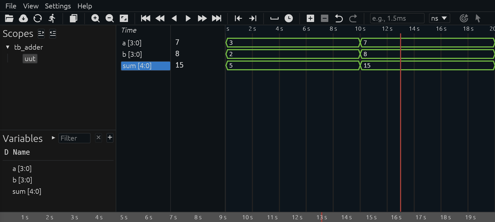
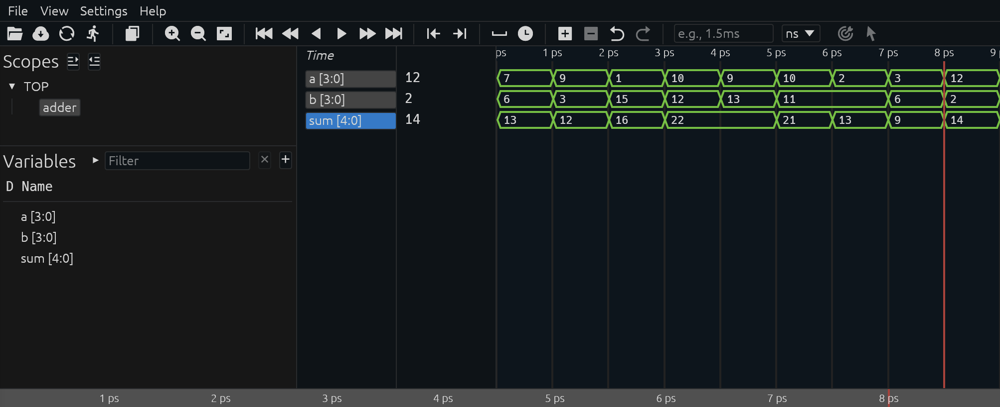

# Simulações e *Test Benches* 

Antes de implementar um circuito em FPGA ou ASIC, é fundamental testar seu funcionamento em simulação. Em Verilog, isso é feito usando um *test bench*, que nada mais é do que um código adicional não sintetizável, escrito para verificar o módulo que você deseja testar.

Considere o seguinte código para um somador de 4 bits:

```verilog
module adder(
  input [3:0] a, b,
  output [4:0] sum);
  assign sum = a + b;
endmodule
```

Este código resulta em um somador simples de 4 bits, que pode ser sintetizado em hardware. Agora, vamos construir um *test bench* simples para testá-lo. O código do teste serve para simular o comportamento do somador, aplicando diferentes valores de entrada e observando a saída. 

- O **design**, também chamado de *Design Under Test* (DUT) ou *Unit Under Test* (UUT) é o circuito que você escreveu, ele será instanciado dentro do *test bench*;
- O **test bench** gera estímulos (sinais de entrada, como clock, reset, dados) e observa as respostas do DUT;
- Dessa forma, você pode verificar se o circuito se comporta corretamente antes de gastar tempo e recursos na síntese e na gravação em hardware.

Exemplo simples de *test bench* para um somador:

```verilog
module tb_adder;
  reg [3:0] a, b;
  wire [4:0] sum;

  adder uut (.a(a), .b(b), .sum(sum));

  initial begin
    a = 4'd3; b = 4'd2;
    #10 a = 4'd7; b = 4'd8;
    #10 $finish;
  end
endmodule
```

Aqui o `uut` (unit under test) recebe valores, e a simulação permite observar se sum tem o resultado esperado.

## DigitalJS

Um simulador simples, mas interessante para quem está começando é o [DigitalJS](https://menotti.pro.br/ld/digitaljs/). Nele você pode interagir gráficamente com o circuito gerado sem a necessidade de criar um *test bench*. 

## Icarus Verilog (`iverilog`)

O [Icarus Verilog](https://github.com/steveicarus/iverilog) é um simulador Verilog de código aberto. Ele ainda não cobre todas as funcionalidades da linguagem, mas é bastante usado por sua simplicidade e facilidade de instalação. 

Usando nosso exemplo do somador acima, podemos executar os seguintes comandos para realizar sua simulação e observar sua saída:

```zsh
 % iverilog *.v && ./a.out
tb_adder.v:10: $finish called at 20 (1s)
```

Ele é capaz de identificar automaticamente a hierarquia entre a implementação e o test bench, mas apenas indica que a simulação terminou quando encontrou a função `$finish`. No entanto, ele não nos dá nenhuma informação útil da simulação, então vamos modificar o test bench para incluir uma chamadas às funções `$display` e `$monitor`. A primeira imprime uma única vez, então usamos para fazer um cabeçalho. A segunda, monitora os sinais e imprime sempre que um deles é modificado. 

```verilog
module tb_adder;
  reg [3:0] a, b;
  wire [4:0] sum;

  adder uut (.a(a), .b(b), .sum(sum));

  initial begin
    $display("Time\t a\t b\t sum");
    $monitor("%3t\t%d\t%d\t%3d", $time, a, b, sum);
    a = 4'd3; b = 4'd2;
    #10 a = 4'd7; b = 4'd8;
    #10 $finish;
  end
endmodule
```

A saída agora nos mostra os valores dos sinais ao longo da simulação:

```zsh
 % iverilog *.v && ./a.out
Time     a       b       sum
  0      3       2        5
 10      7       8       15
tb_adder.v:12: $finish called at 20 (1s)
```

Embora a saída na console possa ser útil em alguns casos, podemos gerar também um arquivo do forma de onda (_waveform_) .VCD para explorar a simulação visualmente. Para isso, vamos incluir a função `$dumpvars`, que resulta na geração deste arquivo. Ele pode ser aberto usando um leitor como o [GTKWave](https://gtkwave.github.io/gtkwave/) ou extensões do VSCode como [WaveTrace](https://marketplace.visualstudio.com/items?itemName=wavetrace.wavetrace) ou [surfer](https://marketplace.visualstudio.com/items?itemName=surfer-project.surfer).



Para conhecer técnicas mais avançadas de simulação e testes, assista a esta [sequência de vídeos](https://www.youtube.com/playlist?list=PLhaFCmjMNuYZCoXbLDGi4-gqSBaKaEMsV) sobre o assunto. 

## Verilator

O [Verilator](https://www.veripool.org/verilator/) é o simulador de Verilog de código aberto mais rápido disponível atualmente. Diferente dos simuladores tradicionais "baseados em eventos" (como o ModelSim ou Icarus Verilog), o Verilator atua como um compilador que converte o hardware em modelos comportamentais de C/C++ altamente otimizados.

No exemplo a seguir, criamos um teste para estimular nosso somador com 10 pares de números aleatórios entre 0 e 15:

```c
#include <stdlib.h>
#include <iostream>
#include "verilated_vcd_c.h"
#include "verilated.h"
#include "Vadder.h"

int main(int argc, char **argv) {
    Vadder *dut = new Vadder;
    Verilated::traceEverOn(true);
    VerilatedVcdC *m_trace = new VerilatedVcdC;
    dut->trace(m_trace, 0);
    m_trace->open("dump.vcd");    
    for (int i = 0; i < 10; i++) {
        dut->a = rand() % 16;
        dut->b = rand() % 16;
        dut->eval();
        m_trace->dump(i);
    }
    m_trace->close();
    delete dut;
    return 0;
}
```

No exemplo a seguir transformamos o arquivo `adder.v` em C/C++, o compilamos junto com o teste criado e o executamos para gerar o diagrama de forma de ondas.

```zsh
 % verilator -Wall --trace -cc adder.v --exe --build tb_adder.cpp && obj_dir/Vadder 
make: Entering directory '/srv/QuestIO42/tutoriais/code/verilog/adder/obj_dir'
g++  -I.  -MMD -I/usr/local/share/verilator/include -I/usr/local/share/verilator/include/vltstd -DVERILATOR=1 -DVM_COVERAGE=0 -DVM_SC=0 -DVM_TIMING=0 -DVM_TRACE=1 -DVM_TRACE_FST=0 -DVM_TRACE_VCD=1 -DVM_TRACE_SAIF=0 -faligned-new -fcf-protection=none -Wno-bool-operation -Wno-int-in-bool-context -Wno-shadow -Wno-sign-compare -Wno-subobject-linkage -Wno-tautological-compare -Wno-uninitialized -Wno-unused-but-set-parameter -Wno-unused-but-set-variable -Wno-unused-parameter -Wno-unused-variable      -Os  -c -o tb_adder.o ../tb_adder.cpp
g++    tb_adder.o verilated.o verilated_vcd_c.o verilated_threads.o Vadder__ALL.a    -pthread -lpthread -latomic   -o Vadder
make: Leaving directory '/srv/QuestIO42/tutoriais/code/verilog/adder/obj_dir'
- V e r i l a t i o n   R e p o r t: Verilator 5.043 devel rev v5.042-27-geafad9742
- Verilator: Built from 0.000 MB sources in 0 modules, into 0.000 MB in 0 C++ files needing 0.000 MB
- Verilator: Walltime 0.699 s (elab=0.000, cvt=0.000, bld=0.698); cpu 0.001 s on 1 threads; alloced 19.203 MB
```

Como boa parte do código Verilog escrito nos _test benchs_ não é sintetizável, não faz diferença e pode até ser mais útil escrevê-lo em uma linguagem de programação, dependendo dos objetivos dos testes. Abaixo a simulação com as entradas aleatórias geradas via software. 



## Cocotb

[cocotb](https://www.cocotb.org/) (COroutine-based COsimulation TestBench) é uma ferramenta de código aberto usada para verificar designs de hardware (RTL) utilizando Python em vez das tradicionais linguagens de verificação como Verilog ou VHDL. Diferente das abordagens tradicionais onde o testbench roda inteiramente dentro do simulador, o cocotb conecta o interpretador Python ao simulador através de interfaces padrão como VPI (Verilog Procedural Interface), VHPI ou FLI. Isso permite que você escreva a lógica do teste em Python enquanto o simulador processa o código HDL.

O exemplo a seguir foi [adaptado do projeto original](https://github.com/cocotb/cocotb/tree/master/examples/adder) para testar o nosso já conhecido somador. Primeiro descrevemos um **golden model** em Python para o nosso somador:

```python
def adder_model(a: int, b: int) -> int:
    """model of adder"""
    return a + b
```

Depois escrevemos os testes propriamente ditos. O primeiro testa o somador com os valores 6 e 10 fixos:

```python
@cocotb.test()
async def adder_basic_test(dut):
    """Test for 6 + 10"""
    A = 6
    B = 10
    dut.a.value = A
    dut.b.value = B
    await Timer(2, unit="ns")
    assert dut.sum.value == adder_model(A, B), (
        f"Adder result is incorrect: {dut.sum.value} != {adder_model(A, B)}"
    )
```

O segundo teste injeta 10 pares de números aleatórios:

```python
@cocotb.test()
async def adder_randomised_test(dut):
    """Test for adding 2 random numbers multiple times"""
    for _ in range(10):
        A = random.randint(0, 15)
        B = random.randint(0, 15)
        dut.a.value = A
        dut.b.value = B
        await Timer(2, unit="ns")
        assert dut.sum.value == adder_model(A, B), (
            f"Randomised test failed with: {dut.a.value} + {dut.b.value} = {dut.sum.value} != {adder_model(A, B)}"
        )
```

A partir de um Makefile, a ferramenta invoca o simulador e roda todos os testes comparando automaticamente os resultados: 

```zsh
 % make
rm -f results.xml
"make" -f Makefile results.xml
make[1]: Entering directory '/srv/QuestIO42/tutoriais/code/python/adder/tests'
/usr/local/bin/iverilog -o sim_build/sim.vvp -s adder -g2012 -f sim_build/cmds.f -s cocotb_iverilog_dump  /srv/QuestIO42/tutoriais/code/python/adder/tests/../../../verilog/adder/adder.v sim_build/cocotb_iverilog_dump.v
rm -f results.xml
COCOTB_TEST_MODULES=test_adder COCOTB_TESTCASE= COCOTB_TEST_FILTER= COCOTB_TOPLEVEL=adder TOPLEVEL_LANG=verilog \
         /usr/local/bin/vvp -M /home/menotti/.local/lib/python3.12/site-packages/cocotb/libs -m libcocotbvpi_icarus   sim_build/sim.vvp -fst  
     -.--ns INFO     gpi                                ..mbed/gpi_embed.cpp:93   in _embed_init_python              Using Python 3.12.4 interpreter at /usr/bin/python3
     -.--ns INFO     gpi                                ../gpi/GpiCommon.cpp:79   in gpi_print_registered_impl       VPI registered
     0.00ns INFO     cocotb                             Running on Icarus Verilog version 13.0 (devel)
     0.00ns INFO     cocotb                             Seeding Python random module with 1776432540
     0.00ns INFO     cocotb                             Initialized cocotb v2.0.1 from /home/menotti/.local/lib/python3.12/site-packages/cocotb
     0.00ns INFO     cocotb                             Running tests
     0.00ns INFO     cocotb.regression                  running test_adder.adder_basic_test (1/2)
                                                            Test for 6 + 10
FST info: dumpfile sim_build/adder.fst opened for output.
     2.00ns INFO     cocotb.regression                  test_adder.adder_basic_test passed
     2.00ns INFO     cocotb.regression                  running test_adder.adder_randomised_test (2/2)
                                                            Test for adding 2 random numbers multiple times
    22.00ns INFO     cocotb.regression                  test_adder.adder_randomised_test passed
    22.00ns INFO     cocotb.regression                  ******************************************************************************************
                                                        ** TEST                              STATUS  SIM TIME (ns)  REAL TIME (s)  RATIO (ns/s) **
                                                        ******************************************************************************************
                                                        ** test_adder.adder_basic_test        PASS           2.00           0.00       2660.52  **
                                                        ** test_adder.adder_randomised_test   PASS          20.00           0.00      50472.97  **
                                                        ******************************************************************************************
                                                        ** TESTS=2 PASS=2 FAIL=0 SKIP=0                     22.00           0.00      10002.05  **
                                                        ******************************************************************************************
```